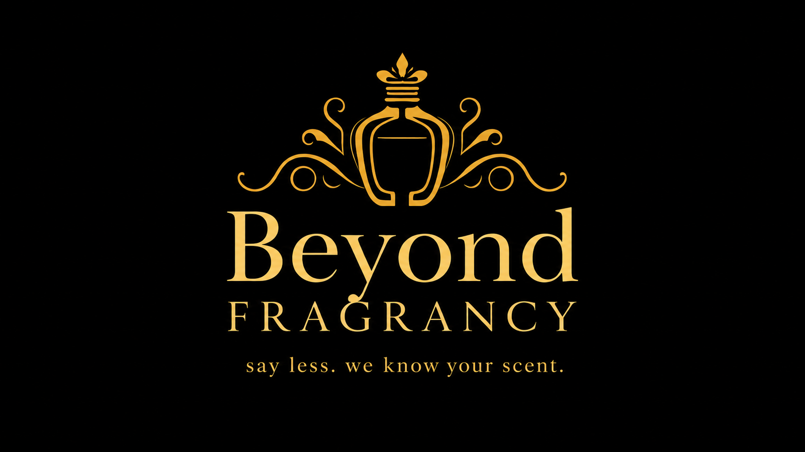

<p align="center">
  
  
</p>

## The Idea

You know that feeling when someone walks past you and the whole room shifts? That is a perfume doing its job. But finding *your* version of that moment has always been weirdly hard. You either rely on a sales associate pushing whatever is on commission, spend money on something that smells completely different on your skin than it did on the tester strip, or just keep repurchasing the one safe option you found years ago because you do not know where to start.

Beyond Fragrancy exists to fix that. Notes? Budget? Vibe? Say less.

We are building an intelligent perfume recommendation engine that learns what you love, understands the DNA of a scent, and suggests fragrances that actually match your taste, your budget, and where you can go buy them today. Not just internationally. Locally too.

---

## The Problem

The global fragrance market is worth over $50 billion and growing. Yet the experience of discovering a new perfume in 2025 is still somehow stuck in the past. You walk into a store overwhelmed, you spray things on paper, your nose gives up after three, and you leave with nothing or the wrong thing.

Online is not much better. Reviews are scattered across forums, fragrance databases, and YouTube rabbit holes. Price comparisons are a separate exercise. And if you are in Nairobi, Lagos, or Accra, almost none of the recommendation tools that exist were built with you in mind. They do not know where you can buy locally. They do not factor in that you want something that performs in a warm, humid climate. They do not speak to your market at all.

The gap is real and it is big.

---

## Who This Is For

Beyond Fragrancy is built for two people simultaneously.

The first is the fragrance curious. Someone who knows they like Dior Sauvage or Chanel Chance but has no idea what to try next or why they liked those in the first place. They want guidance without gatekeeping.

The second is the budget conscious shopper. Someone who has seen Baccarat Rouge 540 all over their feed, wants to understand what makes it special, and needs to know whether there is a version of that experience that does not cost $400 or whether there is a local option that comes close.

Both of these people deserve a tool that takes them seriously. This is that tool.

---

## What It Does

At its core, Beyond Fragrancy is a scent recommendation engine with three layers working together:

**Scent matching.** You tell us perfumes you have loved, or you describe the notes and vibes you are drawn to, and we find fragrances with overlapping DNA. Bergamot forward, woody base, something that lasts. Got it.

**Budget filtering.** Every recommendation comes with a real price tier. Entry level. Mid range. Premium. Luxury. You set your range and we stay inside it. No suggestions you cannot act on.

**Buy links that make sense for where you are.** If you are in Nairobi, we tell you which local stockists carry it and link you to online retailers that actually ship to you. If you are in London or New York, you get the right international options with affiliate links so you can purchase directly.

**Dupe engine.** Cannot afford the original? We find you budget alternatives that share 80-99% of the scent DNA. Smell rich, not broke.

---

## Business Understanding

This project sits at the intersection of machine learning, fragrance culture, and a gap in the African retail market that nobody has seriously addressed yet.

The recommendation engine uses a hybrid content-based filtering approach at its foundation. Three separate TF-IDF vectorizers capture different aspects of a perfume's identity: one for raw ingredient notes, one for weighted accord profiles, and one for contextual signals like gender and season. These are combined into a single weighted matrix at 60% notes, 30% accords, and 10% context. Cosine similarity then measures how closely any two perfumes match in this multi-dimensional scent space.

The system layers five additional signals on top of similarity: a Bayesian popularity score that weights ratings by vote confidence, a perfumer affinity boost for fragrances by the same nose, a collaborative filtering proxy using Fragrantica's pre-computed similar perfume lists, olfactive family diversity enforcement, and smart flanker deduplication so the same fragrance does not appear in multiple versions.

On the business side, the revenue model is affiliate commissions. Every time a user clicks through to purchase a perfume via a partner retailer, Beyond Fragrancy earns a percentage. The primary affiliate partners are Notino (which ships to Kenya and much of Africa), FragranceNet (global discount shipping), and Sephora via Impact.com for the international market. For Kenyan users specifically, Jumia Kenya is included as a local e-commerce option, and the app surfaces physical store locations for retailers like Essenza, Rayan Perfumes, Carrefour, and Naivas where relevant stock is known.

The Kenyan and broader East African angle is not an afterthought. It is a deliberate strategic focus. No perfume discovery app currently exists that is built around local availability, warm climate performance preferences, or African price sensitivities. That is the gap we are walking into.

---

## Data Sources

We did the sniffing so you don't have to. Beyond Fragrancy is built on a master dataset of 150,288 unique perfumes assembled from three public Kaggle datasets and enriched through our own data pipeline. The primary dataset was scraped from Fragrantica as of June 2026, making this one of the most current publicly available perfume datasets in existence, including 2025 and 2026 releases.

### Primary Dataset
**Fragrantica.com Fragrance Dataset** by olgagmiufana1
https://www.kaggle.com/datasets/olgagmiufana1/fragrantica-com-fragrance-dataset

131,930 perfumes with name, brand, launch year, gender, top/middle/base notes, scent accords, ratings, longevity, sillage, price perception votes, seasonal suitability, perfumer credits, and cover image URLs.

### Reference Tables
**FragDB Fragrance Database** by eriklindqvist
https://www.kaggle.com/datasets/eriklindqvist/fragdb-fragrance-database

Four structured lookup tables covering notes, accords, brands, and perfumers. Critical for standardising note names across sources and solving the problem of variant spellings like "Bergamotte" and "Bergamot" being treated as different ingredients.

### Supplementary Dataset
**Fragrantica Perfumes** by ledecanteur
https://www.kaggle.com/datasets/ledecanteur/fragrantica-perfumes

70,100 additional perfume records with strong accord tagging. After deduplication against the primary dataset, this contributed 18,358 genuinely new entries and filled empty fields in existing records.

### The Master Dataset

All three sources are merged into a single master_dataset.csv through our data pipeline. The result after deduplication, enrichment, and validation:

- 150,288 unique perfumes across 4 sources
- 141,975 with full notes data
- 147,108 with accord classifications
- 11,857 flanker relationships mapped across fragrance families
- 7,366 dupe relationships identified between budget and luxury perfumes
- 49,923 perfumer credits linked
- 43,293 similar perfume relationships from Fragrantica community data
- 9 derived features including olfactive family, occasion tags, confidence scoring, and popularity weighting
- 95.51% average data completeness

To reproduce the master dataset, download the three Kaggle datasets above, place them in the data/ folder, and run the data pipeline notebook.

---

## Data Pipeline

### Text Cleaning & Standardisation

The pipeline handles several non-trivial cleaning challenges:

**Encoding repair.** Perfume names from French, Portuguese, Arabic, and German sources contained corrupted characters from latin-1/utf-8 mismatches. A layered encoding fix resolves these before any other processing.

**Note standardisation.** 23,000+ unique note terms were extracted from the dataset. A frequency-based autocorrection system detected rare terms that were likely misspellings of common ones and mapped them to canonical forms, eliminating 830 variant terms. A protected terms list prevents false corrections between distinct ingredients that share string similarity. Terms appearing fewer than 10 times were matched against terms appearing 50+ times using fuzzy string matching at 88% similarity threshold. This caught variants like "lillac" → "lilac" (6 occurrences vs 2,701) and "cashmir wood" → "cashmirwood" (6 occurrences vs 151).

**Accord parsing.** The accords column stored data as accord_name:percentage pairs (e.g., "citrus:100|woody:56|amber:40"). We parsed these properly, extracting both clean accord names for TF-IDF and strength scores for weighted feature engineering. High-strength accords (80-100%) are repeated 3 times in the feature string, strong accords (50-79%) repeated twice, and supporting accords (1-49%) once. This eliminated artefacts like "woody100" and "citrus100" that were being generated by naive string processing.

**Flanker detection.** An algorithm strips concentration markers (EDP, EDT, Parfum) and variant suffixes (Intense, Elixir, Noir, etc.) from perfume names, then uses fuzzy matching within brand groups to identify which perfumes are variations of a common original. 11,857 flanker relationships were detected, grouping perfumes into families for better recommendation deduplication.

**Perfumer and Similar Perfume Data.** Perfumer credits were extracted from `perfumes.jsonl` and matched to 49,923 perfumes. Similar perfume lists from Fragrantica community browsing behavior were loaded for 43,293 perfumes, filtered by confidence score (requiring up_votes > down_votes and up_votes >= 5), and used as a collaborative filtering proxy in the recommendation engine.

### Derived Features

Nine derived features were engineered to enrich the dataset:

- **note_complexity** – Count of unique notes per perfume
- **dominant_note** – The most prominent note based on position in the note pyramid
- **olfactive_family** – Inferred from accords and notes (Floral, Oriental, Woody, Fresh, Gourmand, Fougere, Chypre, Other)
- **best_season** – Season with the highest community vote (Winter, Spring, Summer, Autumn)
- **data_completeness** – Percentage of key fields filled (name, brand, notes, accords, rating, description, gender, year)
- **confidence_score** – Categorical confidence based on vote count (low: <50, medium: <500, high: <5000, very_high: 5000+)
- **confidence_weight** – Numerical weight for popularity scoring (0.2, 0.5, 0.8, 1.0)
- **popularity_score** – Bayesian average rating with 50-vote prior, weighted by confidence
- **occasion_tags** – Inferred from accords and notes (office, date, casual, wedding, sport, evening)
- **limited_edition** – Flagged from name signals (Limited, Edition, Collector, Anniversary, etc.)
- **days_since_release** – Days since launch year for surfacing new perfumes
- **smart_dedup_key** – Normalised key for deduplicating flankers and variants

---

## Model Architecture

```
User Input
  [perfume names they love] or [notes description]
         |
Query Vector Construction
  Seed perfume TF-IDF vectors averaged
  + 20% soft signal from similar_perfumes (collaborative proxy)
         |
Cosine Similarity Search
  Against 150,288 perfume vectors
         |
Filter Layer
  Budget tier, gender, occasion, season
         |
Scoring
  60% TF-IDF similarity
  + 40% Bayesian popularity score
  + perfumer affinity boost
         |
Post-processing
  Flanker deduplication
  Olfactive family diversity enforcement
  Multi-level tie-breaking by rating
         |
Results
  Top N recommendations with buy links
```
---

### Dupe Detection

A dedicated dupe detection system runs on the TF-IDF matrix to identify budget-friendly alternatives to luxury perfumes:

- 6,595 luxury/premium originals were compared against 139,422 budget/mid perfumes
- Cosinesimilarity threshold of 0.75 was used to identify meaningful dupes
- 7,366 dupe relationships were identified
- Dupe similarity distribution: 1,911 perfect matches (1.0), 2,651 high matches (0.9-0.99), 10,681 good matches (0.75-0.9)
- Mean dupe similarity: 0.859
- Top dupe examples include Oud Wonder (budget) → Oud Wood by Tom Ford (0.997), Artisan Blu (budget) → Imagination by Louis Vuitton (0.996)

This powers the "Smell rich, not broke" feature in the app - one of Beyond Fragrancy's most distinctive offerings.

---

### Recommendation Engine

The recommendation engine combines five signals into a single ranked list:

1. **TF-IDF cosine similarity** – How closely the scent DNA matches (60% weight)
2. **Bayesian popularity score** – Confidence-adjusted rating (40% weight)
3. **Similar perfumes from Fragrantica** – Behavioral signal from real user browsing patterns (20% blend into query)
4. **Perfumer affinity boost** – Bonus for fragrances by the same nose (up to +0.15)
5. **Olfactive family diversity** – Ensures no more than 40% from any single family

**Two input modes:**
- **By perfume name** – Users tell us what they already love
- **By notes** – Users describe what they want directly

**Filters available (all optional, gracefully degraded):**
- Budget tier (budget, mid, premium, luxury)
- Gender (male, female, unisex)
- Occasion (office, date, casual, evening, wedding)
- Season (Winter, Spring, Summer, Autumn, auto-detected)

**Flanker deduplication:** The engine uses `flanker_group` as the primary dedup key, falling back to a normalised name+brand key. This prevents multiple versions of the same fragrance from appearing in results.

---

### Key Results

Sanity check similarity scores after model tuning:

| Pair | Similarity | Expected |
|------|-----------|---------|
| Aventus vs Al Dur Al Maknoon Silver (known dupe) | 0.4179 | High |
| Aventus vs Aventus for Her (flanker) | 0.3245 | High |
| Aventus vs Amarige (different family) | 0.1004 | Low |
| Aventus vs Angel (different family) | 0.1109 | Low |

Recommendation test results:

**Test 1: Aventus input**
- Top result: Club de Nuit Intense Man by Armaf (61% similarity, 77% final score) — the most widely recognised Aventus clone globally
- Also returns: Supremacy Silver, Club de Nuit Precieux I, and Insidious — all known Aventus alternatives

**Test 2: Vanilla oud amber — budget filter**
- Top result: Sultan Al Oud by ALREHAB PERFUMES (61% similarity, 85% final score)
- Surfaces Arabic budget houses: Afnan, Al Haramain Perfumes, Maison Alhambra, Reyane Tradition, and Zimaya

**Test 3: Amarige + Organza — female, mid budget**
- Top result: Kalanit by O Boticário (69% similarity, 79% final score)
- Also returns: Pure Poison, Poeme, Poison, Premier Jour — all classic feminine florals

**Test 4: Baccarat Rouge 540 dupe search**
- Top result: Club de Nuit Untold by Armaf (80% similarity, 83% final score)
- Also returns: Amber Rouge by Orientica Premium, Haan Amber, Ruby Whispers, Aquila — all well-known BR540 alternatives in the fragrance community

**Model performance:**
- The model successfully identifies known dupes and flankers
- Achieves meaningful similarity separation between related and unrelated perfumes
- Gracefully degrades filters when they produce too few results
- Popularity weighting surfaces well-loved perfumes over obscure ones

---

## App Features

The Streamlit application (`app/app.py`) provides:

**Three search modes:**
1. **By perfume I love** – Enter perfumes you already love, with fuzzy matching and flanker suggestions
2. **By notes & vibe** – Describe notes or moods (e.g., "warm vanilla oud" or "fresh citrus office")
3. **Find a dupe** – Enter a luxury perfume and get budget-friendly alternatives

**Smart suggestions:**
- Flanker-aware autocomplete suggests variants of the perfume you're typing
- Brand detection filters suggestions to the correct brand when a brand name is detected
- Popular search chips for quick access (Aventus, Baccarat Rouge 540, Black Opium, Sauvage, Good Girl)

**Recommendation cards display:**
- Perfume name, brand, price tier, and match percentage
- Accords and note pills with emojis
- Rating, review count, gender, and season/weather suitability
- "Smells like" dupe information where applicable
- Retailer links: Fragrantica (info), FragranceNet, Notino

**Sidebar controls:**
- Location toggle (Kenya / International)
- Number of results (6-24)
- How matching works explanation

**Visual design:**
- Dark theme with gold accents (#C9A84C)
- Playfair Display SC for perfume names, DM Sans for body text
- Responsive grid layout (3 columns desktop, 2 tablet, 1 mobile)
- Perfume bottle images from Fragrantica CDN where available

---

## Repository Structure

```
Beyond-Fragrancy/
├── app/
│ ├── app.py # Streamlit application
│ └── assets/
│ ├── images/ # Brand imagery (logo, hero, scent categories)
│ └── css/
│ └── style.css # Custom brand styling
├── data/
│ ├── README.md # Dataset download instructions
│ ├── master_dataset.csv # 150,288 unique perfumes
│ └── *.csv # Raw datasets (not tracked)
├── models/
│ ├── README.md # Model regeneration instructions
│ ├── df_with_features_checkpoint.pkl # Processed dataframe
│ ├── tfidf_matrix_checkpoint.npz # TF-IDF matrix (150,288 × 3,208)
│ ├── checkpoints.pkl # Vectorizers, autocorrect map, similar map, dupe results
│ ├── notes_vocab.json # Notes TF-IDF vocabulary
│ ├── accords_vocab.json # Accords TF-IDF vocabulary
│ └── context_vocab.json # Context TF-IDF vocabulary
├── notebooks/
│ ├── beyond_fragrancy_data_pipeline.ipynb # Data collection and merging
│ ├── beyond_fragrancy_recommender.ipynb # Recommendation engine
│ └── eda_charts/ # Visualisations from exploratory analysis
├── README.md
├── .gitignore
└── requirements.txt # Python dependencies
```

**Key model files:**
- `df_with_features_checkpoint.pkl` – 150,288 perfumes with all derived features
- `tfidf_matrix_checkpoint.npz` – 150,288 × 3,208 term matrix (~28 MB)
- `checkpoints.pkl` – Fitted vectorizers, autocorrect map, similar map, dupe results
- `notes_vocab.json`, `accords_vocab.json`, `context_vocab.json` – JSON serialised vocabularies for the app

**To regenerate the model files:**
Run the `beyond_fragrancy_recommender.ipynb` notebook in Colab with the dataset in the `data/` folder. The notebook will download the model files automatically.

---

## Technical Stack

| Component | Technology |
|-----------|------------|
| **Data Processing** | Pandas, NumPy, Scikit-learn |
| **TF-IDF Vectorization** | Three separate vectorizers (notes, accords, context) combined with weights |
| **Similarity Engine** | Cosine similarity on 150,288 × 3,208 sparse matrix |
| **Text Cleaning** | Custom encoding repair + frequency-based autocorrection using RapidFuzz |
| **Recommendation** | 60% TF-IDF similarity + 40% Bayesian popularity + perfumer affinity |
| **Frontend** | Streamlit with custom dark theme and Google Fonts (Playfair Display SC, DM Sans) |
| **Data Sources** | Fragrantica (Kaggle) + FragDB (Kaggle) + Supplement dataset |
| **Deployment** | Streamlit Cloud |

---

## Running Locally

### Prerequisites
- Python 3.9+
- Git

### Setup

1. Clone the repository:
```bash
git clone https://github.com/Daniellamuli/Beyond-Fragrancy.git
cd Beyond-Fragrancy
